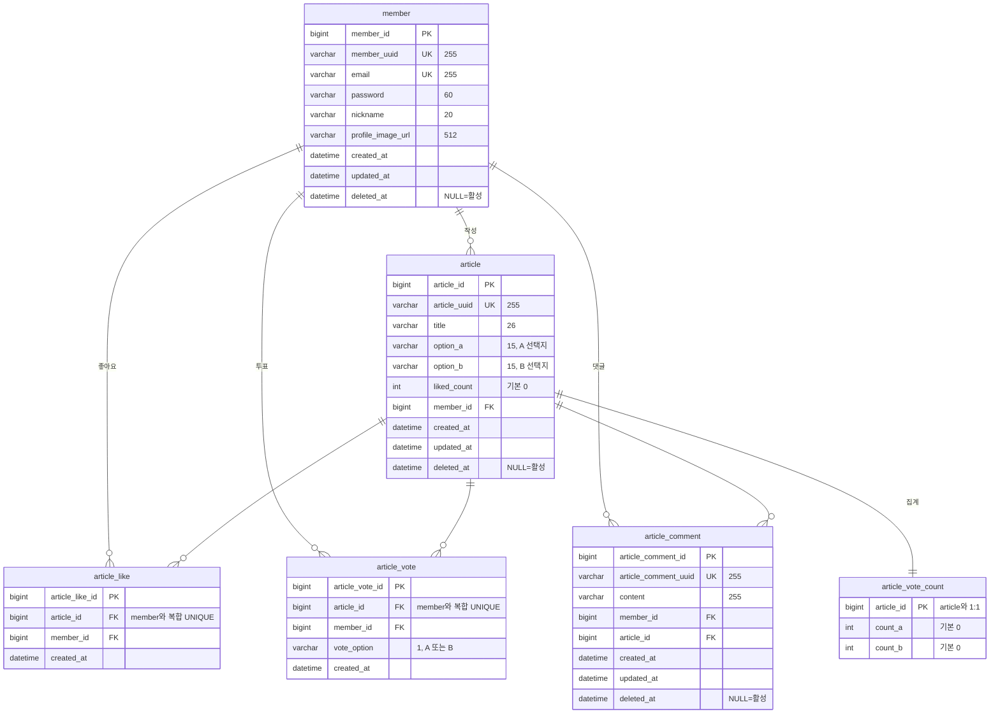

# 반틈 — Back-end

이분법적 선택(A/B)을 주제로 글을 올리고, 투표·좋아요·댓글로 소통하는 커뮤니티 서비스의 백엔드 서버입니다.

## Back-end 소개

Spring Boot 기반 REST API 서버입니다. JWT 쿠키 인증, 커서 페이지네이션, 투표 동시성 제어, S3 Presigned URL 업로드를 구현했고, EC2 위에서 Docker Compose 블루-그린으로 무중단 배포합니다. 배포 직후 콜드 JVM의 꼬리 지연을 줄이기 위한 워밍업을 A/B 테스트로 검증했습니다.

### 개발 인원 및 기간

- 인원: _(작성 예정)_
- 기간: _(작성 예정)_

### 사용 기술 및 tools

| 구분 | 기술 |
| --- | --- |
| Language / Runtime | Java 21 |
| Framework | Spring Boot 3.4.5 (Web, Data JPA, Security, Validation) |
| Auth | Spring Security, JWT (jjwt 0.12.6) |
| DB | MySQL 8.4 (운영), H2 (테스트) |
| Cache | Caffeine |
| Storage | AWS S3 (SDK v2, Presigned URL) |
| Docs | springdoc-openapi (Swagger UI) |
| Build | Gradle |
| Infra | EC2, Docker Compose, Nginx, Let's Encrypt |
| CI/CD | GitHub Actions (OIDC + SSM) |

### 서비스 시연 영상

_(작성 예정)_

## 프로젝트 구조

### 폴더 구조

```
backend/
├── src/main/java/kakaotech/task4
│   ├── common/          # 공통 관심사 (설정·보안·응답·예외·워밍업)
│   └── domain/          # 도메인별 기능
├── src/main/resources/  # application.yml (dev / prod / loadtest 프로파일)
├── deploy/              # 운영 Compose·Nginx·인증서 구성
├── loadtest/            # 부하 테스트 및 블루-그린 전환 실험 스크립트
└── docs/                # CI/CD 설계·트러블슈팅 메모
```

### 패키지 설계 — common / domain 분리

공통 관심사(`common`)와 비즈니스 도메인(`domain`)을 분리했습니다.

- `common`: 보안(JWT·CSRF·쿠키), 공통 응답/예외, 워밍업, 설정, UUID 생성기, `BaseEntity` 등 도메인에 종속되지 않는 코드
- `domain`: `auth`, `member`, `myInfo`, `article`, `comment`, `articleLike`, `articleVote`, `file`

각 도메인은 `api`(Swagger 인터페이스 + 응답 예시) / `controller` / `service` / `repository` / `entity` / `dto` / `code`(예외·성공 코드) 계층으로 구성됩니다. 컨트롤러는 `XxxApi` 인터페이스를 구현해 Swagger 애노테이션을 분리했습니다.

### 서버 아키텍처

클라이언트 → Nginx(HTTPS 종단·리버스 프록시) → Spring Boot(app-blue / app-green) → MySQL. 정적 프론트엔드와 백엔드가 같은 Nginx upstream을 통해 서비스되며, 모든 API는 `/api` context-path 아래에 있습니다.


## 구현 기능

### 회원가입 / 로그인

이메일로 회원가입하고 로그인·로그아웃할 수 있습니다. 로그인하면 일정 시간 뒤 만료되는 인증 정보와, 이를 자동으로 다시 발급받기 위한 정보가 함께 발급되어 사용자가 매번 다시 로그인하지 않아도 됩니다. 인증 정보는 외부 스크립트가 훔쳐가기 어려운 방식으로 보관하고, 다른 사이트가 사용자 몰래 요청을 보내는 공격도 막도록 처리했습니다.

### 내 정보 관리

내 프로필(닉네임·프로필 이미지 등) 조회와 수정, 비밀번호 변경, 회원 탈퇴를 할 수 있습니다. 탈퇴한 계정은 곧바로 지우지 않고 삭제 표시만 남겨 데이터를 안전하게 다룹니다. 프로필 이미지는 정해진 저장소 경로의 이미지만 등록되도록 검증합니다.

### 게시글

두 개의 선택지(A/B)를 담은 게시글을 작성·수정·삭제하고, 목록과 상세를 조회할 수 있습니다.

게시글 목록은 스크롤을 내려도 끊김 없이 다음 글을 이어서 불러옵니다. 데이터가 아무리 많아져도 뒷부분으로 갈수록 느려지지 않도록 조회 방식을 설계했습니다.

### 댓글

게시글에 댓글을 작성·수정·삭제할 수 있습니다.

### 좋아요

게시글에 좋아요를 누르거나 취소할 수 있으며, 좋아요 수가 실시간으로 정확하게 반영됩니다.

### 투표

게시글의 두 선택지 중 하나에 투표할 수 있습니다. 처음 투표, 다른 선택지로 변경, 같은 선택지 재투표를 구분해 처리하며, 각 선택지의 득표수를 집계해 보여줍니다.

여러 사람이 같은 게시글에 **동시에 투표해도 득표수가 누락되지 않도록** 동시성 제어를 적용했습니다. 이 부분은 동시 요청 테스트로 실제로 유실이 없는지 검증했습니다.

### 이미지 업로드

프로필 이미지를 등록할 때, 서버를 거치지 않고 사용자가 저장소(S3)에 직접 안전하게 업로드할 수 있는 임시 업로드 링크를 발급합니다. 서버 부하 없이 업로드가 이뤄지며, 허용된 이미지 형식만 받습니다. 무분별한 업로드 요청을 막기 위해 한 사용자가 일정 시간 안에 받을 수 있는 링크 수를 제한했습니다.

### 배포 직후 성능 최적화(워밍업)

새 서버가 켜진 직후 잠깐 느려지는 구간을 없애기 위해, 트래픽을 넘기기 전에 주요 기능을 미리 몇 차례 실행해 서버를 "예열"하는 장치를 두었습니다. 자세한 개선 내용과 측정 결과는 아래 [성능 개선](#성능-개선--jvm-워밍업) 섹션에 있습니다.

### 일관된 응답 형식과 문서화

모든 API가 성공/실패 여부, 메시지, 데이터를 같은 형식으로 응답하도록 통일했고, 오류 상황도 일관된 형태로 내려줍니다. 또한 API 문서(Swagger)를 자동으로 제공해 프론트엔드와의 협업과 테스트가 편리하도록 했습니다.

## 데이터베이스 설계

### 요구사항 분석

_(작성 예정 — 회원·게시글·댓글·좋아요·투표 간 관계 및 제약 정리)_

### 모델링 — E-R Diagram



핵심 관계와 제약:

- `member 1—N article / article_like / article_vote / article_comment` — 회원이 각 활동의 주체
- `article 1—N article_like / article_vote / article_comment`
- `article 1—1 article_vote_count` — 선택지 텍스트는 `article`에, 득표 집계는 별도 테이블로 분리해 동시 갱신 경합을 집계 row에 국한
- `article_like`, `article_vote`는 `(member_id, article_id)` **복합 UNIQUE**로 1인 1회를 보장 (좋아요는 행 존재/삭제로, 투표는 `vote_option` 갱신으로 처리)
- `article`, `article_comment`는 `(article_id, created_at)` 인덱스로 커서 페이지네이션을 지원
- 모든 주요 테이블은 `created_at / updated_at / deleted_at`을 공통으로 두고 `deleted_at` 기반 soft delete를 사용 (집계 전용 `article_vote_count` 제외)

### UUID 식별자 전략

내부 PK는 `Long`(auto increment)으로 두어 인덱스·조인 효율을 확보하고, 외부에 노출하는 식별자는 접두어가 붙은 UUID 문자열(`ak_`, `ck_`, `mk_`)을 별도 컬럼으로 둡니다. 순차 PK 노출로 인한 리소스 추측을 막고, URL·API에서 도메인을 접두어로 식별할 수 있습니다. 모든 엔티티는 `BaseEntity`를 상속해 `createdAt / updatedAt / deletedAt`(soft delete)을 공통 관리합니다.

## 인프라 · 배포

### 배포 아키텍처 — EC2 + Docker Compose + Nginx

EC2(t3.micro) 한 대에서 Nginx, 프론트엔드(blue/green), 백엔드(app-blue/green), MySQL 8.4, Certbot을 Docker Compose로 함께 운영합니다. Nginx가 HTTPS를 종단하고 `/api`를 백엔드 upstream으로 프록시하며, `/api/internal/`은 외부에서 404로 차단합니다.


### 블루-그린 무중단 배포

비활성 색상 컨테이너를 새 이미지로 기동 → 헬스체크(`/api/auth/csrf`) 통과 → 내부 워밍업 → Nginx upstream 파일 교체 후 reload 순으로 트래픽을 전환합니다. Compose 헬스체크는 부팅 중 짧은 간격(`start_interval`)으로 확인해 배포 게이트로 사용합니다.

### CI/CD — GitHub Actions (OIDC + SSM)

`master` push 시 이미지를 빌드해 Docker Hub에 푸시하고, **OIDC**로 발급한 임시 자격증명으로 **SSM Run Command**를 통해 EC2에서 배포 스크립트를 실행합니다. SSH 키를 저장소에 두지 않습니다. 배포 스크립트는 `flock` 파일 락으로 동시 배포를 직렬화하고, 블루-그린 색상 전환·헬스체크를 수행합니다.

### HTTPS 적용 — Let's Encrypt

Certbot 컨테이너가 webroot 방식으로 인증서를 발급하고 12시간마다 갱신을 확인합니다. 인증서 볼륨을 Nginx와 공유합니다.

### 롤백 전략

배포 전 `compose.yml` / `.env`를 `.bak`으로 백업하고 직전 색상·upstream 설정을 `.rollback` 디렉터리에 보관합니다. 전환 후 헬스체크 실패 시 이전 upstream으로 되돌립니다.

## 성능 개선 — JVM 워밍업

### 문제 인식 — 배포 직후 30초의 꼬리 지연

블루-그린 전환 직후 새 컨테이너로 트래픽이 넘어가면 콜드 JVM이 아직 JIT 최적화되지 않아 초기 요청의 p95/p99가 크게 튀는 현상을 확인했습니다.

### 측정 환경과 부하 강도 결정

Locust로 목록·상세 API에 부하를 주는 로컬 블루-그린 전환 실험을 구성했습니다(`docker-compose.bluegreen-loadtest.yml`). 시드 데이터를 보존한 상태에서 전환 후 0–30초 구간의 꼬리 지연을 측정했습니다.

### 원인 분석 — JIT 컴파일 레벨과 C2 처리량

기동 직후에는 인터프리터·저레벨(C1) 실행 비중이 높아 처리량이 낮고, C2 최적화가 적용되기 전까지 지연이 누적됩니다. 전환 전에 실제 코드 경로를 미리 밟아 두면 이 구간을 사용자 트래픽 밖으로 옮길 수 있습니다.

### 워밍업 엔드포인트 구현

`/internal/warmup`이 대상 경로를 `concurrency`만큼 병렬로 `default-count`회 호출합니다. 회원이 있으면 Access 토큰 쿠키를 발급해 인증 경로까지 데우고, `{articleUuid}`는 실제 게시글로 치환합니다.

### 워밍업 대상 선정 실험

API마다 지나는 코드 경로가 달라 하나를 데운다고 다른 API가 데워지지 않습니다. 자주 호출되면서 서로 다른 경로를 타는 목록·상세만 대상으로 선정하고, 고유 경로가 거의 없는 CSRF·내 정보 조회는 제외했습니다.

### 블루-그린 전환 A/B 테스트 결과

조건 A(전환 즉시)와 B(전환 전 워밍업)를 각각 7회, 총 14회 측정했습니다(2026-08-04).

| API | 지표 | A 중앙값 | B 중앙값 | 개선 |
| --- | --- | --- | --- | --- |
| 목록 | p95 | 200 ms | 58 ms | 71% ↓ |
| 목록 | p99 | 400 ms | 120 ms | 70% ↓ |
| 상세 | p95 | 170 ms | 39 ms | 77% ↓ |
| 상세 | p99 | 530 ms | 81 ms | 85% ↓ |

두 조건 모두 요청 실패는 0건이었습니다. 전환 전 워밍업이 전환 직후 사용자에게 노출되는 꼬리 지연을 크게 줄였습니다.

### 기각한 가설 / 측정 한계

꼬리 지연은 회차 편차가 커서 단일 회차로 결론을 내지 않고 중앙값·표준편차·원값을 함께 확인했습니다. 로컬 수치는 운영과 동일하지 않으며, 운영은 t3.micro 한 대에서 여러 컨테이너가 자원을 공유합니다.

## 트러블 슈팅

### 1. 투표 수 동시 갱신 — 락 없이 집계했을 때의 유실

락 없이 조회 후 증감하면 동시 투표에서 갱신이 덮어써져 집계가 유실됐습니다. 집계 row를 비관적 쓰기 락으로 잠그고 트랜잭션 내에서 증감하도록 바꿔 해결했고, 동시성 테스트로 검증했습니다.

### 2. 블루-그린 전환 직후 지연 — nginx reload와 콜드 JVM

전환 직후 새 컨테이너의 콜드 JVM 때문에 꼬리 지연이 발생했습니다. 전환 순서에서 헬스체크 뒤 워밍업을 넣어 JIT를 유도하고, A/B 테스트로 개선을 확인했습니다.

### 3. _(추가 예정)_

## 테스트

### 단위 테스트 / 동시성 테스트

JUnit 기반 단위 테스트와 투표 집계 동시성 테스트(`ArticleVoteConcurrencyTest`), 집계 영속화(`ArticleVoteCountPersistenceTest`), 인증(`JwtAuthServiceTest`, `AuthServiceTest`), 내 정보(`MyInfoServiceTest`), 보안 리졸버(`CurrentMemberArgumentResolverTest`)를 포함합니다. 테스트는 H2로 실행합니다.

## 컨밴션

### 커밋 메시지

| message | description |
| --- | --- |
| feat | 새로운 기능 추가, 기존 기능을 요구 사항에 맞추어 수정 |
| fix | 기능에 대한 버그 수정 |
| docs | 문서(주석) 수정 |
| style | 코드 스타일, 포맷팅에 대한 수정 |
| refact | 기능 변화가 아닌 코드 리팩터링 |
| test | 테스트 코드 추가/수정 |
| chore | 패키지 매니저 수정, 그 외 기타 수정 (ex. .gitignore) |

### 브랜치 전략

_(작성 예정)_

## 프로젝트 후기

_(작성 예정)_
